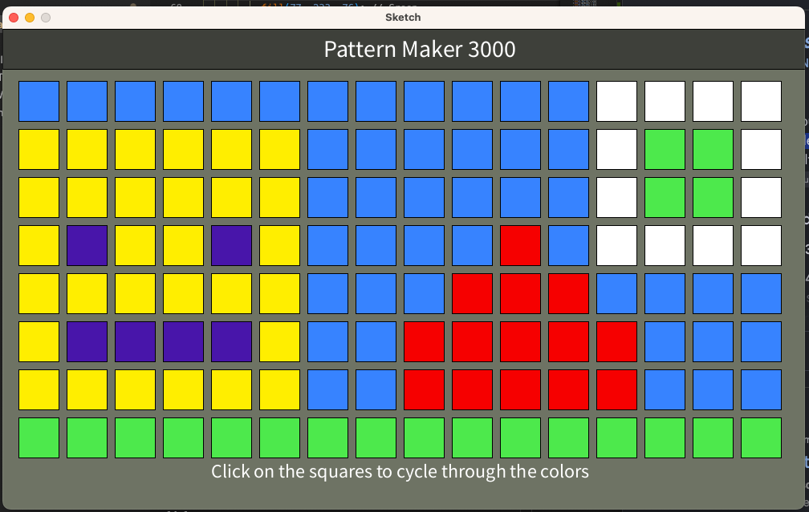

# ICS3U CPT – Interactive Processing Project

This repository contains your ICS3U Culminating Performance Task (CPT).

### Start here:
Please read the full project instructions in **[INSTRUCTIONS.md](INSTRUCTIONS.md)**.

Assessment criteria for this project are described in **[ASSESSMENT.md](ASSESSMENT.md)**.

Once you are ready to submit, replace the contents of this README.md file with:

-- Screenshot of program -- 

-- Description --

The program features a grid of squares which allows the user to click each square to change colours, and clicking the squares multiple times cycles through an arrangement of colours. 

-- User interaction -- 

The user is encouraged to have fun and make different patterns/designs

-- Limitations and incomplete features --

Program has to be restarted to be able to clear the canvas, no abillity to erase, and inefficient to cycle through colours.

-- Attribution -- 

No external assets

This README will be assessed as part of the project professionalism mark.
